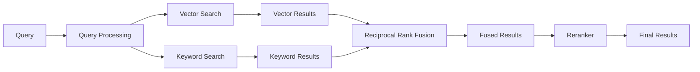
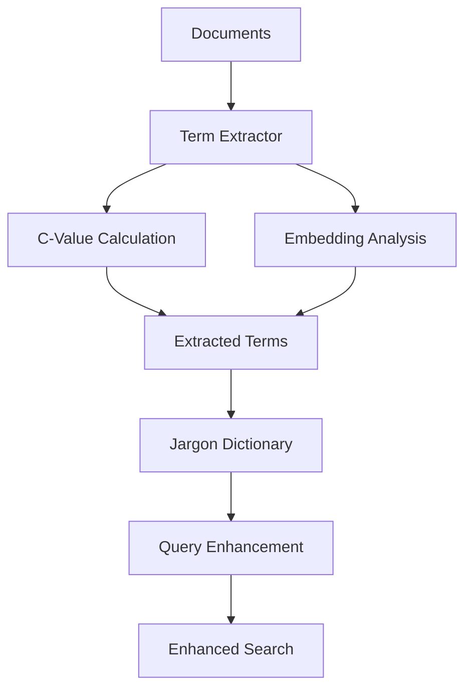

# Advanced RAG System v2 with SemReRank

## 概要

このシステムは、**SemReRank論文の手法を実装**した次世代の高度なRAG（Retrieval-Augmented Generation）システムです。Streamlitベースの直感的なUIを提供し、Azure OpenAI Serviceを活用して、日本語専門文書に特化した強力な情報検索と質問応答を実現します。

### 🌟 主要な特徴

- **ハイブリッドSudachi形態素解析**: Mode C（長単位）+ Mode A（短単位）+ n-gram
- **SemReRank**: Personalized PageRankによる意味的関連性を考慮した専門用語抽出
- **高度な類義語検出**: PGVector意味的類似度 + LLM判定による高精度な類義語・関連語の自動検出
- **RAG定義生成**: ベクトル検索とLLMによる高品質な用語定義の自動生成
- **pgvector埋め込みキャッシュ**: コスト削減と高速化

## 🎯 アップデート履歴

### 2025年10月2日 - 類義語検出システムの大幅改善
- **3カテゴリ分類**: synonyms（類義語）/ variants（表記ゆれ）/ related_terms（関連語）
- **PGVector意味的類似度検出**: embedding + コサイン類似度で高精度な候補抽出
- **LLM最終判定**: Azure OpenAI gpt-4oによる類義語の確定判定
- **ヒューリスティック改善**: PMI共起分析、編集距離による表記ゆれ検出
- **高速処理**: PGVector CROSS JOINで100件を5秒で処理

### 2025年10月1日 - SemReRank統合と最適化
- **ハイブリッド形態素解析**: Sudachi Mode C + Mode A による包括的な候補抽出
- **SemReRank実装**: 低頻度でも重要な専門用語を意味的関連性で救い上げ
- **埋め込みキャッシュ**: pgvectorによる高速化とコスト削減
- **完全ドキュメント**: 全処理ロジックを詳細に記載（2,500行）

### 2025年9月23日 - コード統合と最適化
- **ファイル削減**: 45ファイル → 25ファイル（45%削減）
- **コード統合**: 専門用語処理を`term_extraction.py`に統合
- **不要コード除去**: 約2000行の重複コードを削除

## 主な機能

### 🔍 検索・取得
- **ハイブリッド検索**: ベクトル検索とキーワード検索を組み合わせ、Reciprocal Rank Fusion (RRF) によって検索精度を向上
- **日本語特化**: SudachiPyによる日本語形態素解析、ハイブリッドMode（A+C）で最適化
- **PGVector**: PostgreSQL + pgvectorによる高速ベクトル検索とSQLの統合

### 📝 専門用語処理
- **SemReRank**: Personalized PageRankで低頻度でも重要な用語を抽出
- **ハイブリッド形態素解析**: Mode C（長単位）+ Mode A（短単位）+ n-gram
- **高度な類義語検出**:
  - Phase 2: ヒューリスティック（表記ゆれ・関連語）
  - Phase 3: PGVector意味的類似度（コサイン類似度 >= 0.85）
  - Phase 4: LLM最終判定（必須）
- **RAG定義生成**: ベクトル検索 + LLMによる高品質な定義の自動生成
- **埋め込みキャッシュ**: pgvectorで再計算コストを削減

### 🛠️ その他の機能
- **Text-to-SQL**: 自然言語クエリを自動的にSQLに変換
- **複数のPDF処理**: PyMuPDF（高速）とAzure Document Intelligence（高精度）
- **評価システム**: Recall、Precision、MRR、nDCG、Hit Rateなどの定量評価
- **ナレッジグラフ**: 用語間の関連性を可視化・探索
- **直感的なUI**: Streamlitベースのタブ構成インターフェース

## システム構成

システムは大きく以下のコンポーネントから構成されています：

```
.
├── app.py                      # Streamlitアプリケーションのエントリポイント
├── requirements.txt            # 必要なPythonライブラリ
├── .env.example                # 環境変数の設定テンプレート
├── src/                        # メインソースコード
│   ├── core/                   # コアビジネスロジック
│   │   └── rag_system.py       # RAGシステムのファサード
│   ├── rag/                    # RAGシステムのコアモジュール
│   │   ├── chains.py           # LangChainのチェーンとプロンプト設定
│   │   ├── config.py           # 設定ファイル(Config)
│   │   ├── document_parser.py  # レガシーPDF処理（PyMuPDF）
│   │   ├── evaluator.py        # 評価システムモジュール
│   │   ├── ingestion.py        # ドキュメントの取り込みと処理
│   │   ├── term_extraction.py  # 専門用語抽出と類義語検出（統合版）
│   │   ├── retriever.py        # ハイブリッド検索リトリーバー
│   │   ├── sql_handler.py      # Text-to-SQL機能の処理
│   │   ├── text_processor.py   # 日本語テキスト処理
│   │   └── pdf_processors/     # PDF処理プロセッサ
│   │       ├── base_processor.py      # 抽象基底クラス
│   │       ├── pymupdf_processor.py   # PyMuPDF実装
│   │       └── azure_di_processor.py  # Azure Document Intelligence実装
│   ├── ui/                     # UIコンポーネント
│   │   ├── chat_tab.py         # チャット画面
│   │   ├── data_tab.py         # データ管理画面
│   │   ├── dictionary_tab.py   # 辞書管理画面
│   │   ├── documents_tab.py    # ドキュメント管理画面
│   │   ├── evaluation_tab.py   # 評価システム画面
│   │   ├── settings_tab.py     # 設定画面
│   │   ├── sidebar.py          # サイドバー
│   │   └── state.py            # セッション状態管理
│   ├── scripts/                # 拡張スクリプト
│   │   ├── term_extractor_embeding.py  # 互換性レイヤー（deprecated）
│   │   ├── term_clustering_analyzer.py # クラスタリング分析
│   │   └── knowledge_graph/            # ナレッジグラフ機能
│   └── utils/                  # ユーティリティ関数
│       ├── helpers.py          # ヘルパー関数
│       └── style.py            # UIスタイル設定
├── docs/                       # ドキュメント
│   ├── evaluation/             # 評価関連ドキュメント
│   └── architecture/           # アーキテクチャドキュメント
├── output/                     # 出力ファイル
│   ├── images/                 # 生成された画像
│   └── terms.json              # 抽出された専門用語
└── old/                        # アーカイブ（不要なファイル）
```

## インストール手順

1. **仮想環境の作成と有効化**:
    ```bash
    python -m venv myenv
    source myenv/bin/activate   # Linux/macOS
    myenv\Scripts\activate       # Windows
    ```

2. **依存関係のインストール**:
    ```bash
    pip install -r requirements.txt
    ```

3. **環境変数の設定**:
    `.env.example` ファイルをコピーして `.env` ファイルを作成し、以下の設定を記入してください。

    **必須設定（Azure OpenAI）**:
    - `AZURE_OPENAI_API_KEY`: Azure OpenAIのAPIキー
    - `AZURE_OPENAI_ENDPOINT`: エンドポイントURL
    - `AZURE_OPENAI_CHAT_DEPLOYMENT_NAME`: チャットモデルのデプロイ名
    - `AZURE_OPENAI_EMBEDDING_DEPLOYMENT_NAME`: 埋め込みモデルのデプロイ名

    **PostgreSQL + pgvector設定**:
    - `PG_URL`: PostgreSQLの接続URL、または以下の個別設定
      - `DB_HOST`: ホスト名
      - `DB_PORT`: ポート番号（デフォルト: 5432）
      - `DB_NAME`: データベース名
      - `DB_USER`: ユーザー名
      - `DB_PASSWORD`: パスワード
    - **注意**: PostgreSQLにpgvector拡張のインストールが必要です

    **SemReRank設定（オプション）**:
    - `SEMRERANK_ENABLED`: SemReRankを有効化（デフォルト: true）
    - `SEMRERANK_SEED_PERCENTILE`: シード選定の上位パーセンタイル（デフォルト: 15.0）
    - `SEMRERANK_RELMIN`: 最小類似度閾値（デフォルト: 0.5）
    - `SEMRERANK_RELTOP`: 上位関連語の割合（デフォルト: 0.15）
    - `DEFINITION_GENERATION_PERCENTILE`: 定義生成の上位パーセンタイル（デフォルト: 15.0）

    **PDF処理方式の設定（オプション）**:
    - `PDF_PROCESSOR_TYPE`: "legacy" | "pymupdf" | "azure_di" (デフォルト: "legacy")

    **Azure Document Intelligence設定（azure_di使用時のみ）**:
    - `AZURE_DI_ENDPOINT`: Azure Document IntelligenceのエンドポイントURL
    - `AZURE_DI_API_KEY`: APIキー
    - `AZURE_DI_MODEL`: 使用モデル（デフォルト: "prebuilt-layout"）
    - `SAVE_MARKDOWN`: Markdown保存フラグ（デフォルト: "false"）

## 使い方

以下のコマンドでStreamlitアプリケーションを起動します。

```bash
streamlit run app.py
```

### PostgreSQL + pgvector のセットアップ

pgvector拡張を有効化してください：

```sql
-- PostgreSQLで実行
CREATE EXTENSION IF NOT EXISTS vector;
```

SemReRank用の埋め込みキャッシュテーブルは自動的に作成されます。

### PDF処理方式の選択

本システムは3つのPDF処理方式をサポートしています：

1. **レガシー (既存のDocumentParser)**
   - デフォルトの処理方式
   - 既存の安定した実装

2. **PyMuPDF (高速・軽量)**
   - 高速なPDF処理
   - メモリ効率が良い
   - テキスト、画像、テーブルの抽出

3. **Azure Document Intelligence (高精度)**
   - 高精度なレイアウト解析
   - Markdown形式での出力
   - 複雑な文書構造の正確な抽出
   - クラウドベースの処理

処理方式は以下の方法で選択できます：
- **UIから**: サイドバーまたは詳細設定タブで選択
- **環境変数**: `.env`ファイルで`PDF_PROCESSOR_TYPE`を設定
- **プログラム**: Configオブジェクトで`pdf_processor_type`を指定

## ナレッジグラフ エクスプローラー（新機能）

Streamlitアプリに「ナレッジグラフ エクスプローラー」を統合しました。PostgreSQLの `knowledge_nodes` / `knowledge_edges` を可視化し、関係を対話的に探索できます。

- モード
  - 起点から探索: 指定した中心用語（起点）からBFSで深さ `depth` までを可視化
  - 全体ビュー: 重みの高い順に上位エッジを俯瞰（上限はスライダーで調整、既定200）
- レイアウト
  - 階層表示（固定）。必要に応じて物理シミュレーションをON/OFF可能（既定OFF）
- フィルタ（グラフとエクスポートの両方に反映）
  - 関係タイプ: 該当するエッジのみ表示（空＝全関係）
  - エッジ重み（最小）: 指定以上の重みのエッジのみ表示
  - ノードタイプ: `Term / Category / Domain / System / Component`
  - 孤立ノードを非表示: どのエッジにも接続しないノードを隠す（中心は残す）
  - ノード名の包含/除外キーワード: ラベルに一致するノードを抽出/除外
    - 既定で「クラスタ, cluster」を除外
- エクスポート
  - HTML / JSON（Cytoscape形式）/ DOT（Graphviz）をダウンロード

環境準備（参考）

1) PostgreSQL + pgvector を有効化し、`src/scripts/knowledge_graph/schema.sql` を適用

```bash
python src/scripts/knowledge_graph/setup_database.py
```

2) 用語やクラスタリング結果からノード・エッジを作成（例）

```python
# 例: src/scripts/knowledge_graph/graph_builder.py のユーティリティを利用
```

3) アプリ起動後、サイドバーの「グラフ設定」から各種フィルタを調整して「グラフを生成」を実行

トラブルシュート

- 単一ノードしか表示されない: フィルタ（関係タイプ、重み、ノードタイプ、除外語、孤立ノード非表示）や探索深度を緩める→再生成
- ID型エラー: UUIDをPyVisに渡す際は文字列化済み（修正済）。引き続き問題がある場合はご連絡ください

## 評価システムの使用方法

RAGシステムの検索精度を評価するには、以下のスクリプトを実行します：

```bash
python src/evaluation/evaluator.py
```

### 評価機能の特徴

- **複数の評価指標**: 
  - Recall@K: 関連文書の再現率
  - Precision@K: 検索結果の精度
  - MRR (Mean Reciprocal Rank): 平均逆順位
  - nDCG (Normalized Discounted Cumulative Gain): 正規化減損累積利得
  - Hit Rate@K: ヒット率

- **複数の類似度計算手法**:
  - Azure Embedding: 埋め込みベースの類似度
  - Azure LLM: LLMベースの類似度判定
  - Text Overlap: テキストの重複度
  - Hybrid: 複数手法の組み合わせ

- **柔軟な評価方法**:
  - CSVファイルからの評価データ読み込み
  - プログラムでの直接評価
  - 結果のCSVエクスポート

### 評価データの形式

CSVファイルは以下の形式で準備してください：
- `質問`: 評価用の質問
- `想定の引用元1`, `想定の引用元2`, ...: 期待される情報源
- `チャンク1`, `チャンク2`, ...: 検索結果（オプション）

## アーキテクチャ概要

### システム全体構成

```mermaid
graph TB
    subgraph "Frontend Layer"
        UI[Streamlit UI]
        UI --> ST[State Manager]
    end
    
    subgraph "Application Layer"
        ST --> APP[app.py]
        APP --> TABS[UI Tabs]
        TABS --> CT[Chat Tab]
        TABS --> DT[Data Tab]
        TABS --> DICT[Dictionary Tab]
        TABS --> DOC[Documents Tab]
        TABS --> SET[Settings Tab]
    end
    
    subgraph "RAG Core Engine"
        CT --> CHAIN[LangChain Chains]
        CHAIN --> RET[Hybrid Retriever]
        RET --> VS[Vector Store]
        RET --> KS[Keyword Search]
        RET --> RRF[RRF Fusion]
        
        CHAIN --> SQL[SQL Handler]
        SQL --> CSV[CSV/Excel Parser]
        
        CHAIN --> JARGON[Jargon Dictionary]
        JARGON --> TERMEX[Term Extractor]
    end
    
    subgraph "Data Layer"
        VS --> |PGVector| PG[(PostgreSQL + pgvector)]
        VS --> |ChromaDB| CHROMA[(ChromaDB)]
        SQL --> SQLITE[(SQLite)]
        JARGON --> JSON[(JSON Store)]
    end
    
    subgraph "External Services"
        CHAIN --> AZURE[Azure OpenAI]
        AZURE --> GPT[GPT-4o]
        AZURE --> EMBED[text-embedding-ada-002]
    end
    
    subgraph "Evaluation System"
        EVAL[Evaluator] --> METRICS[Metrics Calculator]
        METRICS --> RECALL[Recall@K]
        METRICS --> PRECISION[Precision@K]
        METRICS --> MRR[MRR]
        METRICS --> NDCG[nDCG]
        METRICS --> HR[Hit Rate@K]
    end
```

### ハイブリッド検索の仕組み



### 専門用語辞書システム



## 技術仕様

- **フロントエンド**: Streamlit
- **バックエンド**: Python 3.9+
- **ベクトルデータベース**: PostgreSQL + pgvector
- **言語モデル**: Azure OpenAI
  - GPT-4o: チャット・定義生成・専門用語判定
  - text-embedding-3-small: 埋め込み生成（1536次元）
- **日本語処理**: SudachiPy（ハイブリッドMode A + C）
- **検索エンジン**: LangChain + カスタムハイブリッドリトリーバー
- **専門用語抽出**:
  - TF-IDF + C-value
  - SemReRank (Personalized PageRank)
  - 6つの類義語検出手法
- **PDF処理**:
  - PyMuPDF (fitz): 高速・軽量処理
  - Azure Document Intelligence: 高精度レイアウト解析・Markdown出力

## 専門用語抽出と自動クラスタリング機能

### 概要
本システムには、PDFなどの文書から専門用語を自動抽出し、クラスタリングによって自動分類する高度な機能が実装されています。

### 専門用語抽出機能（最新版）

#### 完全なSemReRankパイプライン

```
Phase 1: ハイブリッド候補抽出
  ├─ Mode C: 自然な複合語（例: "舶用ディーゼルエンジン"）
  ├─ Mode A + n-gram: 柔軟な複合語生成
  ├─ 正規表現: 型式番号・化学式など
  └─ 複合名詞抽出

Phase 2: 統計的スコアリング
  ├─ TF-IDF計算
  ├─ C-value計算
  └─ 2段階スコア（Seed用/Final用）

Phase 3: SemReRank適用
  ├─ 埋め込みキャッシュ取得（pgvector）
  ├─ 意味的関連性グラフ構築
  ├─ シード選定（上位N%）
  ├─ Personalized PageRank実行
  └─ スコア改訂

Phase 4: 用語関係の分類（3カテゴリ）
  ├─ Phase 2: ヒューリスティック
  │   ├─ variants: 表記ゆれ（編集距離）
  │   └─ related_terms: 関連語（包含・PMI共起）
  ├─ Phase 3: PGVector意味的類似度
  │   └─ synonyms候補（コサイン類似度 >= 0.85）
  └─ Phase 4: LLM最終判定
      └─ synonyms確定（Azure OpenAI gpt-4o）

Phase 5: RAG定義生成
  ├─ 上位N%選定
  ├─ ベクトル検索（k=5）
  └─ LLMで定義生成

Phase 6: LLMフィルタ
  ├─ バッチ処理（デフォルト10件）
  └─ 専門用語判定
```

#### 主要アルゴリズム

**C-value**:
```python
C-value(a) = log₂(|a|) × freq(a) - (1/|Ta|) × Σ freq(b)
```

**Personalized PageRank**:
```python
PR(v) = (1 - α) × p(v) + α × Σ (PR(u) / deg(u))
```

**スコア改訂**:
```python
final_score = base_score × (1 + importance / avg_importance - 1)
```

詳細は [Term_Extraction_Processing_Logic_Documentation.md](Term_Extraction_Processing_Logic_Documentation.md) を参照してください。

### 専門用語クラスタリング機能 (`term_clustering_analyzer.py`)

#### アーキテクチャ
```
入力用語 → ベクトル化 → UMAP次元圧縮 → HDBSCAN → 階層クラスタ → カテゴリ出力
```

#### 主要コンポーネント

1. **UMAP次元圧縮**
   - 1536次元 → 20次元への非線形次元削減
   - コサイン類似度の保持により意味的関係を維持
   - **PCAではなくUMAPを採用**：非線形構造を保持し、局所的・大域的構造を両立
   ```python
   umap.UMAP(
       n_components=20,      # 圧縮後の次元数
       n_neighbors=15,       # 近傍サンプル数
       min_dist=0.1,        # クラスタ内密度制御
       metric='cosine'      # コサイン距離
   )
   ```

2. **HDBSCAN階層的密度ベースクラスタリング**
   - 自動的なクラスタ数決定（K-meansと異なり事前指定不要）
   - 任意形状のクラスタを検出可能
   - ノイズ点の自動検出と適切な処理
   - Condensed Treeによる階層構造から専門用語間の階層関係を抽出
   ```python
   hdbscan.HDBSCAN(
       min_cluster_size=2,              # 最小クラスタサイズ
       cluster_selection_epsilon=0.3,   # クラスタ選択の柔軟性
       cluster_selection_method='leaf', # より多くの点を含む
       metric='euclidean',              # 圧縮後のユークリッド距離
       allow_single_cluster=True        # 単一クラスタ許可
   )
   ```

3. **階層構造分析**
   - λ値（ラムダ値）による概念の一般性・具体性の評価
   - 最大11階層の深さで概念の粒度を表現
   - 上位概念・中間概念・具体的概念への自動分類

4. **LLMによる自動カテゴリ命名（オプション）**
   - Azure OpenAI GPT-4を使用した意味的なクラスタ名生成
   - 各クラスタ内の用語を分析して適切な名前を付与

### 実装結果（2025年9月6日）

#### 改善前後の比較
| 指標 | 改善前（次元圧縮なし） | 改善後（UMAP適用） | 改善率 |
|------|------------------------|-------------------|--------|
| クラスタ数 | 12 | 30 | +150% |
| ノイズ点 | 39 (39.8%) | 6 (6.1%) | -84.6% |
| シルエットスコア | 0.089 | 0.346 | +289% |
| 階層深度 | 10 | 11 | +10% |

#### 実際のクラスタリング例（舶用エンジン専門用語）
- **エンジン部品**: ピストン、コンロッド、カムシャフト、クランクシャフト
- **燃焼制御**: ノッキング、ミスファイア、先燃え、燃料噴射装置
- **排ガス制御**: EGRシステム、SCRシステム、NOx、水噴射
- **船舶エネルギー効率**: EEDI、EEXI、CII、SEEMP
- **海事規制**: IMO、IACS、MARPOL条約、船級協会

### 使用方法

#### 専門用語抽出

**UIから実行（推奨）**:
サイドバーの「📚 用語辞書生成」ボタンから実行

**コマンドラインから**:
```bash
# 新しい統合モジュール使用（推奨）
python -c "from src.rag.term_extraction import run_extraction_pipeline; import asyncio; asyncio.run(run_extraction_pipeline(Path('docs'), Path('output/terms.json'), ...))"

# 互換性レイヤー経由（非推奨）
python src/scripts/term_extractor_embeding.py docs output/terms.json
```

#### クラスタリング分析
```bash
python src/scripts/term_clustering_analyzer.py
```

#### データベースへのインポート
```bash
python src/scripts/import_terms_to_db.py
```

### 技術的な特徴

1. **高精度な用語抽出**
   - C-valueアルゴリズムによる統計的重要度評価
   - 複数の同義語検出手法の組み合わせ
   - 日本語特化の形態素解析

2. **意味的クラスタリング**
   - ベクトル埋め込みによる意味的類似性の捕捉
   - 次元圧縮による「次元の呪い」の回避
   - 密度ベースによる自然なグループ形成

3. **階層的概念構造**
   - Condensed Treeによる統計的階層抽出
   - λ値による概念の抽象度評価
   - 自動的な上位・下位概念の識別

4. **スケーラビリティ**
   - 数千〜数万の用語に対応可能
   - バッチ処理による効率的な処理
   - PostgreSQLによる永続化

## 📚 ドキュメント

- **[Term_Extraction_Processing_Logic_Documentation.md](Term_Extraction_Processing_Logic_Documentation.md)**: 専門用語抽出システムの完全な処理ロジック（2,500行の詳細ドキュメント）
- **[SemReRank_Complete_Implementation_Guide.md](SemReRank_Complete_Implementation_Guide.md)**: SemReRank実装ガイド
- **docs/**: 各種機能のドキュメント

## 🔬 参考文献

1. Zhang, Z., Gao, J., & Ciravegna, F. (2017). "SemRe-Rank: Improving Automatic Term Extraction By Incorporating Semantic Relatedness With Personalised PageRank". ACM Transactions on Knowledge Discovery from Data (TKDD).

2. Frantzi, K., Ananiadou, S., & Mima, H. (2000). "Automatic recognition of multi-word terms: the C-value/NC-value method". International Journal on Digital Libraries.

## ライセンス

このプロジェクトはMITライセンスの下で公開されています。

---

🤖 Generated with [Claude Code](https://claude.com/claude-code)
