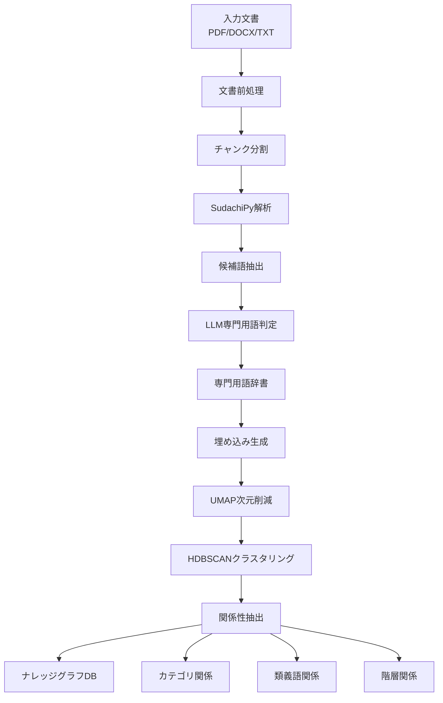

# 専門用語抽出からナレッジグラフ構築までの完全ガイド

## 概要

本システムは、文書から専門用語を自動抽出し、クラスタリング分析を経て、高度なナレッジグラフを構築する包括的なソリューションです。SudachiPyによる日本語解析、LLMによる専門用語抽出、HDBSCANによるクラスタリング、そして多様な関係性の管理により、専門用語間の複雑な関連を捉えます。

### 完全なシステムフロー



## 1. 専門用語抽出プロセス

### 1.1 文書処理と前処理

**対応フォーマット**:
- PDF (PyMuPDF)
- DOCX (Docx2txtLoader)
- TXT (TextLoader)
- その他 (UnstructuredFileLoader)

**チャンク分割**:
```python
text_splitter = RecursiveCharacterTextSplitter(
    chunk_size=2000,      # チャンクサイズ
    chunk_overlap=200,    # オーバーラップ
    separators=["。\n\n", "。\n", "。", "\n\n", "\n", " ", ""]
)
```

### 1.2 SudachiPyによる候補語生成

**形態素解析と品詞フィルタリング**:
```python
# Mode.Cで詳細な形態素解析
sudachi_mode = tokenizer.Tokenizer.SplitMode.C

# 名詞系品詞のみ抽出
target_pos = ['名詞,固有名詞', '名詞,普通名詞', '名詞,サ変可能']

# 複合語の生成
def extract_compound_nouns(text):
    tokens = sudachi_tokenizer.tokenize(text)
    compounds = []
    current = []

    for token in tokens:
        if token.part_of_speech()[0] in target_pos:
            current.append(token.surface())
        elif current:
            if len(current) >= 2:  # 2語以上の複合語
                compounds.append(''.join(current))
            current = []

    return compounds
```

### 1.3 N-gramによる補完

**文字N-gram生成**:
```python
def generate_ngrams(text, min_n=2, max_n=8):
    ngrams = []
    for n in range(min_n, min(max_n + 1, len(text) + 1)):
        for i in range(len(text) - n + 1):
            ngram = text[i:i+n]
            # カタカナ・漢字・英数字で構成される用語
            if is_valid_term(ngram):
                ngrams.append(ngram)
    return ngrams
```

### 1.4 LLMによる専門用語判定

**RAG統合プロンプト**:
```python
extract_prompt = ChatPromptTemplate.from_messages([
    ("system", """あなたは技術文書から専門用語を抽出する専門家です。

    以下の候補語リストから、真の専門用語を選別してください。

    専門用語の基準:
    - 特定の分野で明確な定義を持つ
    - 技術的・学術的意味を持つ
    - 業界固有の概念を表す

    関連文脈も参考にして判断してください。"""),

    ("human", """テキスト: {text}

    候補語リスト: {candidates}

    関連文脈:
    {related_contexts}

    JSONフォーマットで専門用語を抽出してください。""")
])
```

### 1.5 重複排除とスコアリング

**C値による専門用語評価**:
```python
def calculate_c_value(candidates_freq: Dict[str, int]) -> Dict[str, float]:
    """
    C値を計算して専門用語らしさを評価
    C-value(a) = log2|a| × (freq(a) - (1/|Ta|) × Σb∈Ta freq(b))
    """
    c_values = {}

    for candidate, freq in candidates_freq.items():
        length = len(candidate)

        # より長い候補語を探す
        longer_terms = [other for other in candidates_freq
                       if other != candidate and candidate in other]

        # C値を計算
        if not longer_terms:
            c_value = math.log2(length) * freq if length > 1 else freq
        else:
            sum_freq = sum(candidates_freq[term] for term in longer_terms)
            t_a = len(longer_terms)
            c_value = math.log2(length) * (freq - sum_freq / t_a)

        c_values[candidate] = max(c_value, 0)

    return c_values
```

**総合スコアリング**:
```python
class TermScorer:
    def calculate_score(self, term, c_value, metadata):
        score = 0.0

        # C値スコア（最重要）
        score += c_value * 0.4

        # 出現頻度スコア
        frequency = metadata.get('frequency', 1)
        score += min(frequency * 0.1, 1.0) * 0.2

        # 文字数スコア（3-20文字が最適）
        if 3 <= len(term) <= 20:
            score += 0.2

        # 複合語スコア
        if self.is_compound_noun(term):
            score += 0.2

        return min(score, 1.0)
```

**注**: TF-IDFは使用していません。代わりにC値と共起頻度を用いて専門用語の重要度を評価しています。

## 2. クラスタリングプロセス

### 2.1 データベースへの保存

**PostgreSQLへの専門用語登録**:
```python
def save_to_database(terms):
    engine = create_engine(PG_URL)
    for term in terms:
        query = text("""
            INSERT INTO jargon_terms
            (term, definition, domain, aliases, confidence)
            VALUES (:term, :def, :domain, :aliases, :conf)
            ON CONFLICT (term) DO UPDATE SET
                definition = EXCLUDED.definition,
                confidence = GREATEST(jargon_terms.confidence, EXCLUDED.confidence)
        """)
        engine.execute(query, term)
```

### 2.2 埋め込みベクトル生成

**Azure OpenAI Embeddingsの使用**:
```python
embeddings = AzureOpenAIEmbeddings(
    azure_deployment=cfg.azure_openai_embedding_deployment_name,
    api_version=cfg.azure_openai_api_version,
    azure_endpoint=cfg.azure_openai_endpoint
)

# 用語+定義でエンベディング生成
texts = [f"{term}: {definition}" for term, definition in terms]
embeddings_matrix = embeddings.embed_documents(texts)
```

## 3. HDBSCAN/UMAPの技術詳細

### 3.1 UMAPによる次元削減

**用途**: 高次元の埋め込みベクトル（1536次元）を20次元に圧縮

**選定理由**:
- **非線形次元削減**: PCAと異なり、非線形構造を保持
- **局所的・大域的構造の保存**: 近傍関係と全体的なクラスタ構造を両立
- **計算効率**: t-SNEより高速で大規模データに対応可能

**パラメータ設定**:
```python
umap_reducer = umap.UMAP(
    n_components=20,      # 20次元に削減
    n_neighbors=15,       # 近傍サンプル数
    min_dist=0.1,        # クラスタ内密度制御
    metric='cosine',     # コサイン距離使用
    random_state=42
)
```

### 3.2 HDBSCANによるクラスタリング

**用途**: 専門用語を意味的に類似したグループに自動分類

**選定理由**:
- **密度ベースクラスタリング**: 任意形状のクラスタを検出
- **階層構造の抽出**: クラスタの階層関係を自動推定
- **ノイズ耐性**: 外れ値を適切に処理
- **パラメータ調整の柔軟性**: クラスタ数の事前指定不要

**パラメータ設定**:
```python
clusterer = hdbscan.HDBSCAN(
    min_cluster_size=2,              # 最小クラスタサイズ
    min_samples=1,                    # サンプル密度
    cluster_selection_epsilon=0.3,    # クラスタ選択の柔軟性
    cluster_selection_method='leaf',  # より多くの点を含む
    metric='euclidean',              # ユークリッド距離
    allow_single_cluster=True,
    prediction_data=True
)
```

### 3.3 処理フロー

1. **正規化**: L2正規化でコサイン類似度に対応
2. **次元削減**: UMAPで1536→20次元
3. **クラスタリング**: HDBSCANで自動グループ化
4. **評価**: シルエット係数で品質評価

## 4. 関係性の実装

### 4.1 カテゴリ分類

クラスタリング結果から専門用語をカテゴリに分類：

- **クラスタ→カテゴリノード**: 各クラスタがカテゴリとして機能
- **BELONGS_TO関係**: 用語→カテゴリへの所属関係
- **LLMによる命名**: 各カテゴリに意味的な名前を付与

### 4.2 類義語関係

複数の方法で類義語を検出・管理：

#### データベースのエッジタイプ
- **SYNONYM**: 完全な同義語関係（双方向）
- **SIMILAR_TO**: 意味的類似関係（双方向）

#### 実装方法
```python
# 1. 辞書データからの類義語
synonyms = term_data.get('synonyms', term_data.get('aliases', []))

# 2. クラスタ内の類似関係
for i, term1 in enumerate(cluster_terms):
    for term2 in cluster_terms[i+1:]:
        # 同一クラスタ内の用語は類似
        db.create_edge(
            term1_id, term2_id,
            edge_type='SIMILAR_TO',
            weight=0.7,
            confidence=0.8
        )
```

### 4.3 階層関係

HDBSCANの階層情報から上位・下位関係を推定：

#### エッジタイプ
- **IS_A**: 下位→上位の関係（例: "Python" IS_A "プログラミング言語"）
- **HAS_SUBTYPE**: 上位→下位の関係（逆方向）
- **BELONGS_TO**: 用語→カテゴリの所属関係

#### 階層推定ロジック
```python
def build_hierarchy_from_clustering(db, clustering_results, term_to_id):
    hierarchy = clustering_results.get('hierarchy', {})
    term_hierarchy = hierarchy.get('term_hierarchy', [])

    # λ値でソート（小さいほど一般的）
    sorted_terms = sorted(term_hierarchy, key=lambda x: x.get('lambda', 999))

    for i, term_info in enumerate(sorted_terms):
        # より一般的な用語を親として検出
        for j in range(i):
            potential_parent = sorted_terms[j]
            if is_hierarchical_relation(term_info, potential_parent):
                db.create_edge(
                    source_id=term_id,
                    target_id=parent_id,
                    edge_type='IS_A',
                    provenance='hierarchy'
                )
```

### 4.4 その他の関係性

システムは以下の関係性もサポート：

#### 構成関係
- **PART_OF**: 部分→全体
- **HAS_COMPONENT**: 全体→部分
- **INCLUDES**: 包含関係

#### 機能関係
- **USED_FOR**: ツール→目的
- **PERFORMS**: エージェント→アクション
- **CONTROLS**: 制御関係
- **MEASURES**: 測定関係

#### プロセス関係
- **CAUSES**: 原因→結果
- **PREVENTS**: 防止関係
- **PROCESSES**: 処理関係
- **GENERATES**: 生成関係

## 5. ナレッジグラフ構築プロセス

### 5.1 データフロー

```python
# 1. 専門用語の読み込み
terms = load_terms_from_json("terms.json")

# 2. エンベディング生成
embeddings = generate_embeddings(terms)

# 3. クラスタリング実行
clustering_results = perform_clustering(embeddings)

# 4. ノード作成
for term in terms:
    node_id = db.create_node(
        node_type='Term',
        term=term['term'],
        definition=term['definition'],
        embedding=term_embedding
    )

# 5. 関係構築
build_category_relationships(db, clustering_results)
build_hierarchy_from_clustering(db, clustering_results)
build_similarity_from_clusters(db, clustering_results)
```

### 5.2 信頼度と重み

各関係には信頼度(confidence)と重み(weight)を付与：

- **confidence**: 関係の確実性（0.0-1.0）
- **weight**: 関係の強度（0.0-1.0）
- **provenance**: 関係の出所（clustering, llm, manual等）

## 6. 評価と最適化

### 6.1 クラスタリング品質評価

- **シルエット係数**: クラスタの分離度評価
- **クラスタ数とノイズ点**: 適切な粒度の確認
- **階層の深さ**: 意味的な階層構造の妥当性

### 6.2 パラメータ最適化

```python
# 最適化可能なパラメータ
optimization_params = {
    'umap_n_neighbors': [10, 15, 20],
    'umap_min_dist': [0.05, 0.1, 0.15],
    'hdbscan_min_cluster_size': [2, 3, 5],
    'cluster_selection_epsilon': [0.2, 0.3, 0.4]
}
```

## 7. 実装上の考慮事項

### 7.1 スケーラビリティ

- **バッチ処理**: 大規模データセット対応
- **インデックス**: HNSWインデックスで高速検索
- **キャッシング**: エンベディング結果のキャッシュ

### 7.2 拡張性

- **新しい関係タイプ**: スキーマで定義済みタイプを拡張可能
- **複数ドメイン対応**: ドメイン別クラスタリング
- **動的更新**: 新規用語の追加と関係の自動更新

---

## Appendix A: term_extractor_embeding.py (専門用語抽出)

```python
#!/usr/bin/env python3
"""term_extractor_embeding.py
LCEL記法版 専門用語・類義語辞書生成（SudachiPy + RAG統合版）
"""

from sudachipy import tokenizer, dictionary
from langchain_openai import AzureChatOpenAI, AzureOpenAIEmbeddings
from langchain_community.vectorstores import PGVector
from langchain_core.prompts import ChatPromptTemplate
from pydantic import BaseModel, Field

# SudachiPy Setup
sudachi_mode = tokenizer.Tokenizer.SplitMode.C

class Term(BaseModel):
    """専門用語モデル"""
    term: str = Field(description="専門用語")
    definition: str = Field(description="用語の定義")
    domain: str = Field(description="ドメイン/分野")
    synonyms: List[str] = Field(description="類義語リスト")
    confidence: float = Field(description="信頼度スコア")

class TermList(BaseModel):
    """専門用語リスト"""
    terms: List[Term] = Field(default_factory=list)

def extract_candidate_terms(text: str) -> List[str]:
    """SudachiPyとN-gramによる候補語抽出"""
    candidates = set()

    # SudachiPyによる複合語抽出
    tokenizer_obj = dictionary.Dictionary().create()
    tokens = tokenizer_obj.tokenize(text, sudachi_mode)

    current_compound = []
    for token in tokens:
        pos = token.part_of_speech()[0]
        if pos.startswith('名詞'):
            current_compound.append(token.surface())
        else:
            if len(current_compound) >= 2:
                candidates.add(''.join(current_compound))
            current_compound = []

    # N-gram生成（2-8文字）
    for n in range(2, min(9, len(text) + 1)):
        for i in range(len(text) - n + 1):
            ngram = text[i:i+n]
            if is_technical_term_pattern(ngram):
                candidates.add(ngram)

    return list(candidates)

async def search_similar_chunks(query_text: str, vector_store: PGVector) -> str:
    """既存のRAGベクトルストアから類似文脈を取得"""
    results = vector_store.similarity_search_with_score(
        query_text[:1000],  # クエリを制限
        k=3
    )

    contexts = []
    for doc, score in results:
        if score > 0.7:  # 類似度閾値
            contexts.append(f"[類似度: {score:.2f}]\n{doc.page_content[:500]}")

    return "\n\n".join(contexts)

# プロンプト定義
extract_prompt = ChatPromptTemplate.from_messages([
    ("system", """あなたは技術文書から専門用語を抽出する専門家です。

    専門用語の基準:
    - 特定の分野で明確な定義を持つ
    - 技術的・学術的意味を持つ
    - 業界固有の概念を表す

    関連文脈も参考にして、用語の定義と類義語を生成してください。"""),

    ("human", """テキスト: {text}

    候補語リスト: {candidates}

    関連文脈:
    {related_contexts}

    専門用語をJSON形式で抽出してください。""")
])

class TermScorer:
    """専門用語のスコアリング"""

    def calculate_score(self, term: str, metadata: Dict) -> float:
        score = 0.0

        # 出現頻度
        frequency = metadata.get('frequency', 1)
        score += min(frequency * 0.1, 1.0)

        # 文字数（3-20文字が最適）
        if 3 <= len(term) <= 20:
            score += 0.3

        # 複合語パターン
        if self.is_compound_noun(term):
            score += 0.4

        # カタカナ/英語
        if self.contains_technical_pattern(term):
            score += 0.2

        return min(score, 1.0)

    def is_compound_noun(self, term: str) -> bool:
        """複合名詞判定"""
        tokenizer_obj = dictionary.Dictionary().create()
        tokens = tokenizer_obj.tokenize(term)
        noun_count = sum(1 for t in tokens if t.part_of_speech()[0].startswith('名詞'))
        return noun_count >= 2

    def contains_technical_pattern(self, term: str) -> bool:
        """技術用語パターン判定"""
        import re
        # カタカナ、英数字、漢字の組み合わせ
        patterns = [
            r'[ァ-ヴー]+',  # カタカナ
            r'[A-Z][a-z]+',  # 英単語
            r'[A-Z]{2,}',    # 略語
        ]
        return any(re.search(p, term) for p in patterns)

# メイン処理チェーン（LCEL）
def create_extraction_chain(llm, vector_store):
    """専門用語抽出チェーンの構築"""

    return (
        RunnablePassthrough.assign(
            candidates=RunnableLambda(lambda x: extract_candidate_terms(x['text'])),
            related_contexts=RunnableLambda(
                lambda x: asyncio.run(search_similar_chunks(x['text'], vector_store))
            )
        )
        | extract_prompt
        | llm.with_structured_output(TermList)
    )
```

## Appendix B: term_clustering_analyzer.py (クラスタリング分析)

```python
#!/usr/bin/env python3
"""term_clustering_analyzer.py
専門用語のクラスタリング分析ツール
HDBSCANを使用して専門用語を自動的にカテゴリ分類
"""

import hdbscan
import umap
from sklearn.metrics import silhouette_score
from sklearn.preprocessing import normalize

class TermClusteringAnalyzer:
    def __init__(self, connection_string: str, min_terms: int = 3):
        self.connection_string = connection_string
        self.min_terms = min_terms
        self.terms_data = []
        self.embeddings_matrix = None
        self.clusters = None
        self.clusterer = None

    def perform_clustering(self, min_cluster_size: int = 3) -> Dict[str, Any]:
        """HDBSCANによるクラスタリング実行"""

        # ベクトルを正規化（コサイン類似度のため）
        normalized_embeddings = normalize(self.embeddings_matrix, norm='l2')

        # UMAP次元圧縮
        logger.info(f"Applying UMAP dimensional reduction: {normalized_embeddings.shape[1]} -> 20 dimensions")
        umap_reducer = umap.UMAP(
            n_components=20,
            n_neighbors=15,
            min_dist=0.1,
            metric='cosine',
            random_state=42
        )
        reduced_embeddings = umap_reducer.fit_transform(normalized_embeddings)

        # HDBSCAN実行
        self.clusterer = hdbscan.HDBSCAN(
            min_cluster_size=2,
            min_samples=1,
            cluster_selection_epsilon=0.3,
            cluster_selection_method='leaf',
            metric='euclidean',
            allow_single_cluster=True,
            prediction_data=True
        )

        self.clusters = self.clusterer.fit_predict(reduced_embeddings)

        # シルエット係数計算
        silhouette = None
        if n_clusters >= 2:
            mask = self.clusters >= 0
            if sum(mask) >= 2:
                silhouette = silhouette_score(
                    self.reduced_embeddings[mask],
                    self.clusters[mask]
                )

        return {
            'n_clusters': n_clusters,
            'n_noise': n_noise,
            'silhouette_score': silhouette,
            'cluster_labels': self.clusters.tolist()
        }
```

## Appendix C: graph_builder.py (ナレッジグラフ構築)

```python
def build_hierarchy_from_clustering(db: KnowledgeGraphDB,
                                   clustering_results: Dict,
                                   term_to_id: Dict) -> int:
    """クラスタリング結果から階層関係を構築"""
    logger.info("Building hierarchy from clustering results...")

    hierarchy = clustering_results.get('hierarchy', {})
    term_hierarchy = hierarchy.get('term_hierarchy', [])

    # λ値でソート（小さいほど一般的な用語）
    sorted_terms = sorted(term_hierarchy, key=lambda x: x.get('lambda', 999))

    edge_count = 0
    for i, term_info in enumerate(sorted_terms):
        term = term_info['term']
        if term not in term_to_id:
            continue

        term_id = term_to_id[term]

        # より一般的な用語を探す
        for j in range(i):
            potential_parent = sorted_terms[j]['term']
            if potential_parent in term_to_id:
                parent_id = term_to_id[potential_parent]

                # IS_A関係を作成
                edge_id = db.create_edge(
                    source_id=term_id,
                    target_id=parent_id,
                    edge_type='IS_A',
                    weight=0.6,
                    confidence=0.7,
                    provenance='hierarchy',
                    evidence='Clustering hierarchy analysis'
                )
                if edge_id:
                    edge_count += 1

    return edge_count

def build_similarity_from_clusters(db: KnowledgeGraphDB,
                                  clustering_results: Dict,
                                  term_to_id: Dict) -> int:
    """クラスタ内の用語間に類似関係を構築"""
    logger.info("Building similarity relationships from clusters...")

    clusters = clustering_results.get('clusters', {})
    edge_count = 0

    for cluster_id, cluster_info in clusters.items():
        if cluster_id == '-1':  # ノイズクラスタはスキップ
            continue

        terms = cluster_info['terms']

        # クラスタ内の全ペアに類似関係を作成
        for i, term1 in enumerate(terms):
            if term1 not in term_to_id:
                continue

            for term2 in terms[i+1:]:
                if term2 not in term_to_id:
                    continue

                # 双方向の類似関係
                edge_id = db.create_edge(
                    source_id=term_to_id[term1],
                    target_id=term_to_id[term2],
                    edge_type='SIMILAR_TO',
                    weight=0.7,
                    confidence=0.8,
                    provenance='clustering'
                )
                if edge_id:
                    edge_count += 1

    return edge_count
```

## Appendix D: import_terms_to_db.py (データベース登録)

```python
#!/usr/bin/env python3
"""JSONファイルからPostgreSQLデータベースに専門用語をインポート"""

import json
from pathlib import Path
from sqlalchemy import create_engine, text

def import_terms_to_db(json_file: str, connection_string: str):
    """JSONファイルから専門用語をDBにインポート"""

    # JSONファイル読み込み
    with open(json_file, 'r', encoding='utf-8') as f:
        data = json.load(f)

    terms = data.get('terms', [])
    engine = create_engine(connection_string)

    success_count = 0
    error_count = 0

    for term in terms:
        try:
            # 類義語をJSON配列として準備
            synonyms = term.get('synonyms', term.get('aliases', []))
            if isinstance(synonyms, str):
                synonyms = [synonyms]

            query = text("""
                INSERT INTO jargon_terms
                (term, definition, domain, aliases, confidence)
                VALUES (:term, :definition, :domain, :aliases::jsonb, :confidence)
                ON CONFLICT (term) DO UPDATE SET
                    definition = COALESCE(EXCLUDED.definition, jargon_terms.definition),
                    domain = COALESCE(EXCLUDED.domain, jargon_terms.domain),
                    aliases = CASE
                        WHEN jargon_terms.aliases IS NULL THEN EXCLUDED.aliases
                        WHEN EXCLUDED.aliases IS NULL THEN jargon_terms.aliases
                        ELSE jargon_terms.aliases || EXCLUDED.aliases
                    END,
                    confidence = GREATEST(jargon_terms.confidence, EXCLUDED.confidence),
                    updated_at = NOW()
                RETURNING term;
            """)

            with engine.connect() as conn:
                result = conn.execute(query, {
                    'term': term.get('term'),
                    'definition': term.get('definition', ''),
                    'domain': term.get('domain', 'general'),
                    'aliases': json.dumps(synonyms, ensure_ascii=False),
                    'confidence': term.get('confidence', 0.8)
                })
                conn.commit()
                success_count += 1

        except Exception as e:
            error_count += 1
            print(f"Error importing {term.get('term')}: {e}")

    print(f"Import complete: {success_count} terms imported, {error_count} errors")
    return success_count, error_count
```

## Appendix E: schema.sql (データベース定義)

```sql
-- Knowledge Graph Database Schema
CREATE TABLE knowledge_nodes (
    id UUID PRIMARY KEY DEFAULT uuid_generate_v4(),
    node_type VARCHAR(50) NOT NULL CHECK (
        node_type IN ('Term', 'Category', 'Domain', 'Component', 'System')
    ),
    term VARCHAR(255),
    definition TEXT,
    properties JSONB DEFAULT '{}',
    embedding vector(1536),
    created_at TIMESTAMP DEFAULT NOW(),
    updated_at TIMESTAMP DEFAULT NOW()
);

CREATE TABLE knowledge_edges (
    id UUID PRIMARY KEY DEFAULT uuid_generate_v4(),
    source_id UUID REFERENCES knowledge_nodes(id) ON DELETE CASCADE,
    target_id UUID REFERENCES knowledge_nodes(id) ON DELETE CASCADE,
    edge_type VARCHAR(50) NOT NULL CHECK (
        edge_type IN (
            -- Hierarchical relations
            'IS_A',           -- 〜の一種である
            'HAS_SUBTYPE',    -- 下位分類を持つ
            'BELONGS_TO',     -- カテゴリに属する

            -- Compositional relations
            'PART_OF',        -- 〜の一部である
            'HAS_COMPONENT',  -- 構成要素を持つ

            -- Association relations
            'RELATED_TO',     -- 関連する
            'SIMILAR_TO',     -- 類似する
            'SYNONYM',        -- 同義語
            'CO_OCCURS_WITH', -- 共起する

            -- その他の関係...
        )
    ),
    weight FLOAT DEFAULT 1.0 CHECK (weight >= 0 AND weight <= 1),
    confidence FLOAT DEFAULT 1.0 CHECK (confidence >= 0 AND confidence <= 1),
    properties JSONB DEFAULT '{}',
    created_at TIMESTAMP DEFAULT NOW()
);

-- Indexes for performance
CREATE INDEX idx_nodes_embedding_hnsw
ON knowledge_nodes
USING hnsw (embedding vector_l2_ops)
WITH (m = 16, ef_construction = 64);
```