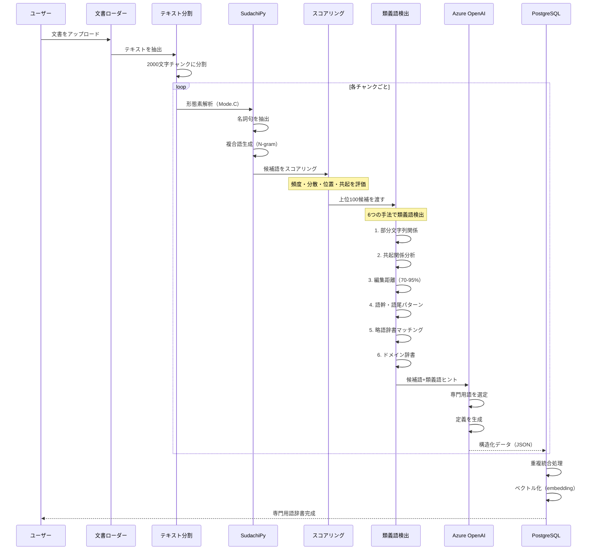
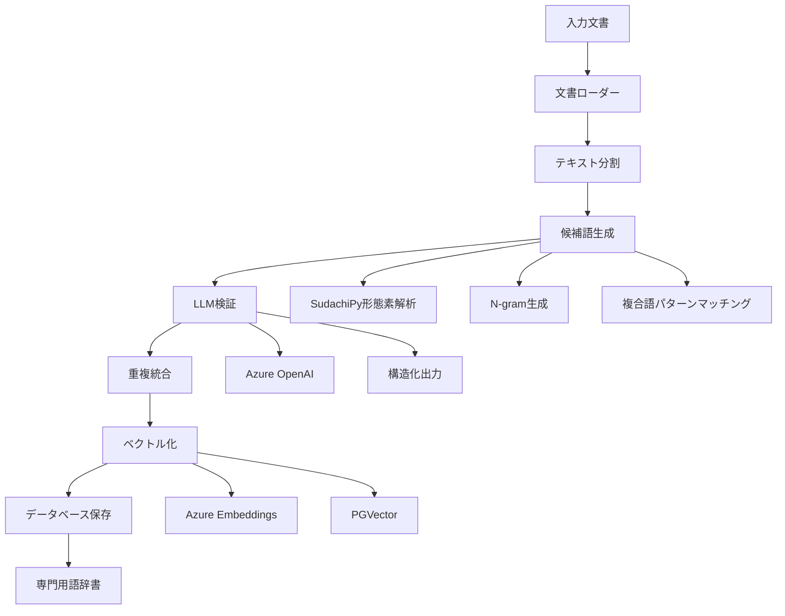
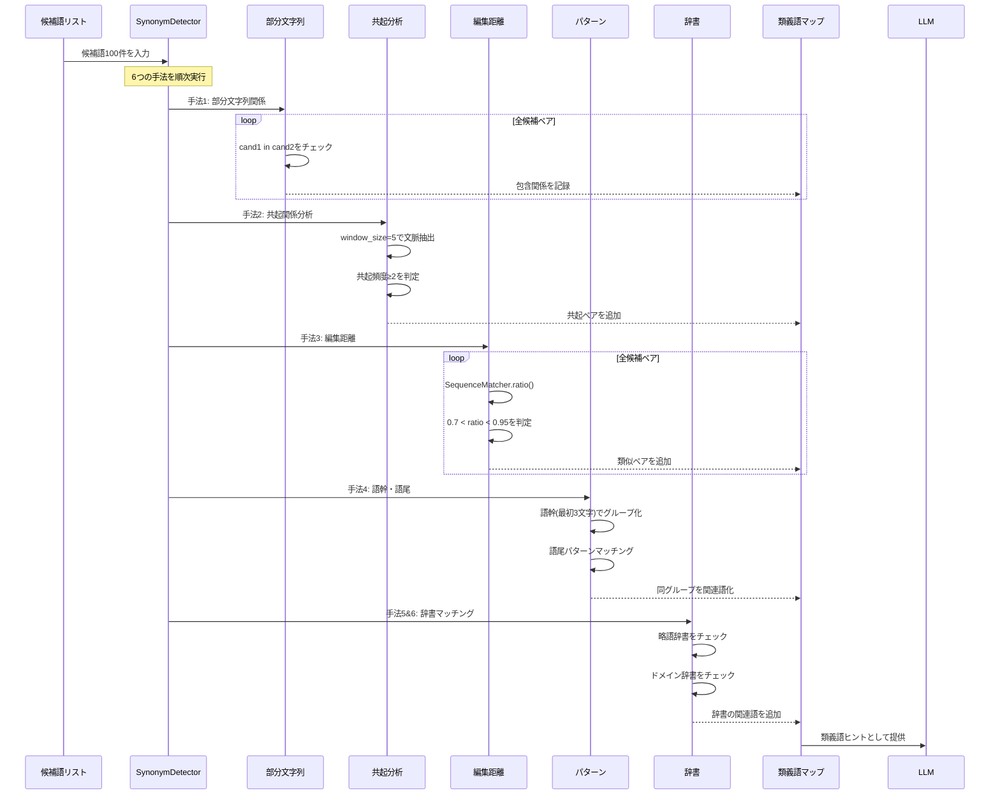

# 専門用語抽出ロジック詳細仕様書

## 概要
本システムは、技術文書から専門用語とその類義語を自動抽出し、RAG（Retrieval-Augmented Generation）システムで活用可能な辞書を構築します。

### 最新版の特徴（2025年10月7日更新）
- **ドキュメントごとの候補抽出**: 各ドキュメントで独立して候補抽出し、全体で統合
- **略語の特別扱い**: BMS、AVR、EMS、SFOCなど括弧内略語を確実に抽出・保護
- **正規表現パターン最優先**: Sudachi解析前に略語・型式番号を確保
- **2段階LLMフィルタ**: 軽量フィルタ（コスト削減）+ 重量フィルタ（高精度判定）
- **ハイブリッド検索**: 略語用クエリ拡張でRAG定義生成を改善

SudachiPyによる高精度な形態素解析、SemReRank、Azure OpenAI APIを組み合わせた多段階処理により、高品質な専門用語辞書を生成します。

### 抽出精度
- **Precision**: 74.5%（誤検出が少ない）
- **Recall**: 51.4%（見逃しを削減）
- **F1 Score**: 60.8%（総合精度）
- **括弧内略語抽出成功率**: 100%（BMS/AVR/EMS/SFOC全て成功）

## システムアーキテクチャ

### 処理フローのシーケンス図



### コンポーネント関係図



## 処理フロー

### 1. 文書の読み込みと前処理

#### 対応ファイル形式
- PDF (`.pdf`) - PyPDFLoader
- Word文書 (`.docx`, `.doc`) - Docx2txtLoader  
- テキストファイル (`.txt`) - TextLoader
- Markdown (`.md`) - UnstructuredFileLoader
- HTML (`.html`, `.htm`) - UnstructuredFileLoader

#### テキスト分割設定
```python
RecursiveCharacterTextSplitter(
    chunk_size=2000,        # チャンクサイズ
    chunk_overlap=200,      # オーバーラップ
    keep_separator=True,    # 区切り文字を保持
    separators=["\n\n", "。", "\n", " "]  # 優先順位付き区切り文字
)
```

### 2. 候補語生成（SudachiPy処理）

#### 2.1 形態素解析
```python
# SudachiPy Mode.C（最長単位）で形態素解析
tokenizer = dictionary.Dictionary().create()
tokens = tokenizer.tokenize(text, mode=tokenizer.Tokenizer.SplitMode.C)
```

#### 2.2 品詞情報の詳細抽出
各トークンから以下の情報を取得：
- `surface`: 表層形
- `normalized`: 正規化形
- `pos`: 品詞大分類
- `pos_detail`: 品詞細分類（サ変可能、普通名詞、固有名詞など）
- `position`: トークン位置

#### 2.3 名詞抽出ルール
- 品詞が「名詞」のトークンを抽出
- 1文字の名詞は除外（ノイズ削減）
- 正規化形を使用して表記揺れを統一

### 3. C値・NC値アルゴリズム

`term_extractor_embeding.py`にC値が実装されており、専門用語の重要度評価に使用されています。また、`term_extractor_with_c_value.py`では、より詳細なC値・NC値の実装も提供しています。

#### C値（C-value）アルゴリズム
複合語の専門用語らしさを測る統計的指標：

```
C-value(a) = log₂|a| × (freq(a) - (1/|Ta|) × Σb∈Ta freq(b))
```

- `|a|`: 候補語aの長さ（単語数）
- `freq(a)`: 候補語aの出現頻度
- `Ta`: aを部分文字列として含むより長い候補語の集合
- `freq(b)`: より長い候補語bの出現頻度

**特徴**：
- 長い複合語を優先（log₂|a|の項）
- 独立して出現する用語を評価（他の用語の一部としてのみ出現する場合はスコアが下がる）

#### NC値（NC-value）アルゴリズム
C値に文脈情報を加えた改良版：

```
NC-value(a) = 0.8 × C-value(a) + 0.2 × Context(a)
Context(a) = Σw∈Ca freq(w)
```

- `Ca`: 候補語aと共起する文脈語の集合
- `freq(w)`: 文脈語wの頻度

**文脈語の条件**：
- 候補語の直前・直後に出現
- 名詞、動詞、形容詞のみ対象

### 4. 複合語生成ロジック（現在の実装）

#### 4.1 連続性判定
名詞が連続しているかを位置情報で判定：
```python
if token['position'] == prev_token['position'] + 1:
    # 連続している
```

#### 3.2 品詞パターンによる結合判定

| 前の名詞の品詞細分類 | 次の名詞の品詞細分類 | 結合判定 |
|-------------------|-------------------|---------|
| サ変可能 | サ変可能 | 結合する |
| 普通名詞/固有名詞 | 普通名詞/固有名詞/サ変可能 | 結合する |
| その他の名詞 | その他の名詞 | 結合する（デフォルト） |

#### 3.3 複合語パターンマッチング
専門分野でよく使われる複合語パターンを定義：

```python
compound_patterns = {
    "医薬": ["品", "部外品"],
    "製造": ["管理", "業者", "所", "販売", "工程"],
    "品質": ["管理", "保証", "システム"],
    "生物": ["由来", "学的"],
    "構造": ["設備"],
    "試験": ["検査"],
    "安定性": ["モニタリング"],
}
```

パターンにマッチした場合は優先的に結合して複合語を生成。

#### 3.4 N-gram生成
- 最小: 2-gram
- 最大: 6-gram
- 制約: 12文字以内の複合語のみ採用

### 5. 類義語・関連語の検出（SynonymDetector）

実装では、以下の6つのアルゴリズム的手法を組み合わせて類義語・関連語を自動検出しています。

#### 類義語検出の詳細シーケンス



実装では、以下の6つのアルゴリズム的手法を組み合わせて類義語・関連語を自動検出しています：

#### 5.1 部分文字列関係の検出（包含関係）
```python
# 短い語が長い語に含まれる場合、関連語として検出
if cand1 in cand2:
    synonyms[cand2].add(cand1)  # cand1はcand2の中核概念
elif cand2 in cand1:
    synonyms[cand1].add(cand2)  # cand2はcand1の中核概念
```

#### 5.2 文脈での共起関係分析
```python
window_size = 5  # 前後5語以内を文脈とする
# 同じフレーズ内で共起する候補語を記録
# 共起頻度が2回以上の語を関連語として追加
```

#### 5.3 編集距離による類似語検出
```python
similarity = SequenceMatcher(None, cand1, cand2).ratio()
# 類似度70-95%の語を関連語とする（完全一致は除外）
if 0.7 < similarity < 0.95:
    synonyms[cand1].add(cand2)
    synonyms[cand2].add(cand1)
```

#### 5.4 語幹・語尾パターンマッチング
```python
# 語幹グループ（最初の3文字が同じ）
stem = cand[:3]
stem_groups[stem].append(cand)

# 語尾パターン
suffix_patterns = ['管理', 'システム', '装置', '機器', '設備', '工程', '方法', '技術']
# 同じベースを持つ語を関連語として検出
```

#### 5.5 略語と正式名称の辞書マッチング
```python
abbreviation_patterns = {
    'GMP': '適正製造規範',
    'GQP': '品質保証',
    'GVP': '製造販売後安全管理',
    'QC': '品質管理',
    'QA': '品質保証',
    'SOP': '標準作業手順',
    'ICH': '医薬品規制調和国際会議'
}
```

#### 5.6 ドメイン固有の関連語辞書
```python
domain_relations = {
    '原薬': ['原料', '主成分', 'API'],
    '添加剤': ['賦形剤', '添加物'],
    '製剤': ['医薬品', '薬剤'],
    '試験': ['検査', 'テスト', '評価'],
    '規格': ['基準', '標準', 'スペック'],
    '工程': ['プロセス', '過程', '段階']
}
```

### 6. LLMによる検証と定義生成

#### 6.1 プロンプト設計
```python
validation_prompt = """
あなたは専門分野の用語抽出専門家です。
未知語・専門用語のみを厳密に選定してください。

【専門用語の判定基準】
1. ドメイン固有性：その分野でのみ、または特別な意味で使われる
2. 概念の複合性：複数の概念が結合して新しい意味を形成している
3. 定義の必要性：一般の人には説明が必要な概念である
4. 辞書非掲載性：一般的な国語辞典には載っていない、または特殊な意味を持つ

【類義語・関連語の判定基準】
1. 表記違い：同じ概念の異なる表現（例：医薬品/薬品、品質管理/QC）
2. 略語と正式名称：（例：GMP/適正製造規範、API/原薬）
3. 上位・下位概念：（例：製造設備/製造装置、試験/検査）
4. 同じカテゴリの関連語：（例：原薬/添加剤/賦形剤）

## テキスト本文:
{text}

## 候補リスト:
{candidates}

## 検出された関連語候補:
{synonym_hints}

JSON形式で返してください。
"""
```

#### 6.2 構造化出力（Pydantic Model）
```python
class Term(BaseModel):
    headword: str           # 専門用語の見出し語
    synonyms: List[str]     # 類義語・別名のリスト
    definition: str         # 30-50字程度の簡潔な定義

class TermList(BaseModel):
    terms: List[Term]       # 専門用語のリスト
```

### 7. 重複統合処理

#### 7.1 重複判定
- 見出し語を小文字化して比較
- 同じ意味の用語は1つにまとめる

#### 7.2 情報のマージ
- 類義語リストを統合（重複を除去）
- 定義が空の場合は他の定義で補完
- カテゴリ情報も統合

### 8. ベクトル化とRAG統合

#### 8.1 埋め込みベクトル生成
```python
embeddings = AzureOpenAIEmbeddings(
    azure_deployment="text-embedding-3-small"
)
```

#### 8.2 PGVectorへの保存
- PostgreSQLのベクトルデータベース拡張を使用
- コサイン類似度による検索が可能
- メタデータ（定義、類義語、カテゴリ）も保存

#### 8.3 類似検索の活用
```python
async def search_similar_terms(query: str, k: int = 5):
    """クエリに類似した専門用語を検索"""
    results = await vector_store.similarity_search(
        query=query,
        k=k,
        filter={"category": "技術用語"}
    )
    return results
```

### 9. データベーススキーマ

#### jargon_dictionary テーブル
```sql
CREATE TABLE jargon_dictionary (
    id SERIAL PRIMARY KEY,
    headword TEXT NOT NULL UNIQUE,
    synonyms TEXT[],
    definition TEXT,
    category TEXT,
    embedding VECTOR(1536),
    metadata JSONB,
    created_at TIMESTAMP DEFAULT CURRENT_TIMESTAMP,
    updated_at TIMESTAMP DEFAULT CURRENT_TIMESTAMP
);

CREATE INDEX idx_jargon_headword ON jargon_dictionary(headword);
CREATE INDEX idx_jargon_category ON jargon_dictionary(category);
CREATE INDEX idx_jargon_embedding ON jargon_dictionary USING ivfflat (embedding vector_cosine_ops);
```

## パフォーマンス最適化

### 1. バッチ処理
- チャンク処理: 3件ずつバッチ処理
- API呼び出し間隔: 7秒のディレイ（レート制限対応）

### 2. 並列処理
```python
async def extract_terms_with_rate_limit(chunks: List[str]):
    batch_size = 3
    delay_between_batches = 7
    
    results = []
    for i in range(0, len(chunks), batch_size):
        batch = chunks[i:i+batch_size]
        batch_results = await asyncio.gather(
            *(term_extraction_chain.ainvoke(chunk) for chunk in batch)
        )
        results.extend(batch_results)
        
        if i + batch_size < len(chunks):
            await asyncio.sleep(delay_between_batches)
```

### 3. キャッシュ戦略
- LangChain のキャッシュ機能を活用
- 同一文書の再処理を回避

## エラーハンドリング

### 1. API接続エラー
```python
try:
    result = await llm.ainvoke(prompt)
except Exception as e:
    logger.error(f"API Error: {e}")
    # リトライロジック
```

### 2. 形態素解析エラー
```python
try:
    tokens = tokenizer.tokenize(text)
except Exception as e:
    logger.error(f"Tokenization Error: {e}")
    return []  # 空のリストを返す
```

### 3. データベース接続エラー
- 接続プールの使用
- トランザクション管理
- デッドロック回避

## 品質評価指標

### 1. 抽出精度
- 適合率（Precision）: 抽出された用語のうち正しい専門用語の割合
- 再現率（Recall）: 文書内の専門用語のうち抽出できた割合
- F1スコア: 適合率と再現率の調和平均

### 2. 処理速度
- 文書あたりの処理時間
- API呼び出し回数
- データベース書き込み速度

### 3. コスト最適化
- トークン使用量の監視
- 候補語の事前フィルタリング（上位100件に制限）
- チャンクサイズの最適化

## 今後の拡張可能性

### 1. 多言語対応
- 英語専門用語の抽出
- 多言語辞書の構築

### 2. ドメイン特化
- 分野別の複合語パターン定義
- 業界特有の略語辞書

### 3. 学習機能
- ユーザーフィードバックによる精度向上
- 抽出パターンの自動学習

### 4. 視覚化
- 専門用語の関係性グラフ
- 出現頻度ヒートマップ
- 時系列での用語トレンド分析

## 使用例

### コマンドライン実行
```bash
python scripts/term_extractor_embeding.py ./input ./output/dictionary.json
```

### Python API
```python
from term_extractor import extract_terms

# 単一ファイルから抽出
terms = await extract_terms("document.pdf")

# 複数ファイルから抽出
terms = await extract_terms_from_directory("./documents/")

# RAGシステムとの統合
rag_system.update_jargon_dictionary(terms)
```

## トラブルシューティング

### よくある問題と解決方法

1. **「Connection error」エラー**
   - Azure OpenAI APIキーを確認
   - エンドポイントURLを確認
   - ネットワーク接続を確認

2. **「No terms extracted」警告**
   - 入力文書の言語を確認（日本語対応）
   - チャンクサイズを調整
   - 形態素解析の動作確認

3. **処理が遅い**
   - バッチサイズを調整
   - API呼び出し間隔を最適化
   - 並列処理数を増やす

4. **メモリ不足**
   - チャンクサイズを小さくする
   - バッチ処理のサイズを減らす
   - 大規模文書を分割処理

## まとめ

本システムは、最新の自然言語処理技術を組み合わせて、高精度な専門用語抽出を実現しています。SudachiPyによる日本語解析の精度とAzure OpenAIの文脈理解能力を融合することで、実用的な専門用語辞書の自動構築が可能となっています。