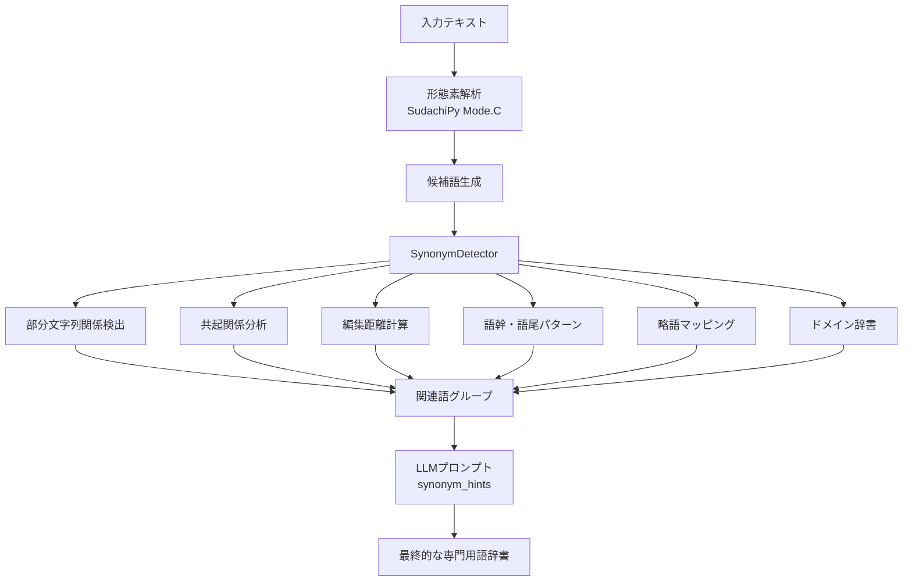

# 関連語（類義語）検出ロジック詳細仕様書

## 概要
本ドキュメントは、専門用語抽出システムにおける関連語・類義語の自動検出ロジックの詳細を説明します。SynonymDetectorクラスは、複数のアルゴリズムを組み合わせて高精度な関連語検出を実現しています。

## システム構成図



## 検出アルゴリズム詳細

### 1. 部分文字列関係の検出（包含関係）

#### アルゴリズム
```python
for i, cand1 in enumerate(candidates):
    for cand2 in candidates[i+1:]:
        if cand1 != cand2:
            if cand1 in cand2:
                synonyms[cand2].add(cand1)  # 短い方が中核概念
            elif cand2 in cand1:
                synonyms[cand1].add(cand2)
```

#### 検出例
| 基準語 | 検出される関連語 | 関係性 |
|--------|-----------------|--------|
| 製造管理 | 製造 | 製造 ⊂ 製造管理 |
| 品質管理システム | 品質管理、システム | 部分概念 |
| 医薬品製造 | 医薬品、製造 | 複合概念の構成要素 |

#### 特徴
- **利点**: 上位・下位概念の関係を自動検出
- **注意点**: ノイズ（偶然の部分一致）を含む可能性あり
- **精度向上策**: 頻度やスコアによるフィルタリング

### 2. 共起関係分析

#### アルゴリズム
```python
window_size = 5  # 前後5語以内を文脈とする

for phrase in noun_phrases:
    occurring_cands = [c for c in candidates if c in phrase_str]
    for cand1 in occurring_cands:
        for cand2 in occurring_cands:
            if cand1 != cand2:
                cooccurrence_map[cand1].add(cand2)

# 共起頻度が高い語を関連語として追加
for cand, related in cooccurrence_map.items():
    if len(related) >= 2:  # 2回以上共起
        synonyms[cand].update(related)
```

#### 検出パターン
1. **同一文内での共起**
   - 例：「品質管理（QC）と品質保証（QA）」
   - → QC ⟷ 品質管理、QA ⟷ 品質保証

2. **並列構造での共起**
   - 例：「原薬、添加剤、賦形剤を混合」
   - → 原薬 ⟷ 添加剤 ⟷ 賦形剤（同カテゴリ）

3. **説明的共起**
   - 例：「GMP（適正製造規範）」
   - → GMP ⟷ 適正製造規範

#### 共起スコア計算
- 共起回数
- 共起距離（近いほど高スコア）
- 文書全体での共起確率

### 3. 編集距離による類似語検出

#### アルゴリズム
```python
from difflib import SequenceMatcher

for i, cand1 in enumerate(candidates):
    for cand2 in candidates[i+1:]:
        similarity = SequenceMatcher(None, cand1, cand2).ratio()
        
        # 70-95%の類似度を関連語とする
        if 0.7 < similarity < 0.95:
            synonyms[cand1].add(cand2)
            synonyms[cand2].add(cand1)
```

#### 類似度の閾値設定

| 類似度範囲 | 関係性 | 例 |
|-----------|--------|-----|
| 95-100% | ほぼ同一（表記揺れ） | システム/システムズ |
| 85-95% | 強い関連性 | 検査/検査法 |
| 70-85% | 中程度の関連性 | 試験/試験法 |
| <70% | 関連性が低い | - |

#### 検出される表記揺れパターン
- 送り仮名の違い：行う/行なう
- カタカナ表記：バリデーション/ヴァリデーション
- 長音記号：サーバー/サーバ
- 漢字・ひらがな：すべて/全て

### 4. 語幹・語尾パターンによる関連語検出

#### 4.1 語幹グループ化
```python
stem_groups = defaultdict(list)
for cand in candidates:
    if len(cand) >= 3:
        stem = cand[:3]  # 最初の3文字を語幹とする
        stem_groups[stem].append(cand)

# 同じ語幹を持つ語を関連語とする
for stem, group in stem_groups.items():
    if len(group) > 1:
        for word in group:
            synonyms[word].update(w for w in group if w != word)
```

#### 4.2 語尾パターンマッチング
```python
suffix_patterns = ['管理', 'システム', '装置', '機器', '設備', '工程', '方法', '技術']

for suffix in suffix_patterns:
    if cand.endswith(suffix):
        base = cand[:-len(suffix)]
        # 同じベースを持つ他の候補を探す
        for other_cand in candidates:
            if other_cand.startswith(base):
                synonyms[cand].add(other_cand)
```

#### 検出例

| パターン | 検出される関連語群 |
|---------|------------------|
| 語幹「製造」 | 製造、製造管理、製造工程、製造設備 |
| 語幹「品質」 | 品質、品質管理、品質保証、品質基準 |
| 語尾「〜管理」 | 製造管理、品質管理、工程管理、在庫管理 |
| 語尾「〜システム」 | 管理システム、製造システム、品質システム |

### 5. 略語と正式名称のパターン検出

#### 事前定義辞書
```python
abbreviation_patterns = {
    'GMP': '適正製造規範',
    'GQP': '品質保証',
    'GVP': '製造販売後安全管理',
    'QC': '品質管理',
    'QA': '品質保証',
    'SOP': '標準作業手順',
    'ICH': '医薬品規制調和国際会議',
    'API': '原薬',
    'CTD': '国際共通化資料',
}
```

#### 動的検出アルゴリズム
1. **括弧パターンの検出**
   - 「品質管理（QC）」→ QC = 品質管理
   - 「Active Pharmaceutical Ingredient (API)」→ API = Active Pharmaceutical Ingredient

2. **頭文字パターンの検出**
   - 大文字の連続をチェック
   - 対応する日本語の頭文字と照合

### 6. ドメイン固有の関連語辞書

#### 医薬品製造ドメインの関連語
```python
domain_relations = {
    # 原料関連
    '原薬': ['原料', '主成分', 'API', '有効成分'],
    '添加剤': ['賦形剤', '添加物', '補助剤'],
    '製剤': ['医薬品', '薬剤', '製品'],
    
    # 試験関連
    '試験': ['検査', 'テスト', '評価', '分析'],
    '規格': ['基準', '標準', 'スペック', '仕様'],
    '適合': ['合格', '適格', '準拠'],
    
    # 工程関連
    '工程': ['プロセス', '過程', '段階', 'ステップ'],
    '製造': ['生産', '製作', '調製'],
    'バリデーション': ['検証', '妥当性確認', 'バリ'],
    
    # 管理関連
    '管理': ['マネジメント', '統制', 'コントロール'],
    '記録': ['記載', '文書', 'レコード'],
    '手順': ['手続き', 'プロシージャ', 'SOP'],
}
```

#### カテゴリ別関連語グループ

| カテゴリ | 関連語グループ |
|---------|--------------|
| 原材料 | 原薬、原料、添加剤、賦形剤、添加物 |
| 品質 | 品質管理、品質保証、QC、QA、品質基準 |
| 製造 | 製造管理、製造工程、製造設備、GMP |
| 試験 | 試験、検査、分析、評価、測定 |
| 文書 | SOP、手順書、記録、報告書、文書 |

## スコアリングと優先順位

### 総合スコア計算
```python
def calculate_synonym_score(term1, term2):
    score = 0.0
    
    # 1. 部分文字列関係（最大3点）
    if term1 in term2 or term2 in term1:
        score += 3.0
    
    # 2. 編集距離（最大5点）
    similarity = SequenceMatcher(None, term1, term2).ratio()
    score += similarity * 5.0
    
    # 3. 共起頻度（最大4点）
    cooccurrence = get_cooccurrence_count(term1, term2)
    score += min(cooccurrence * 0.5, 4.0)
    
    # 4. ドメイン辞書（最大5点）
    if in_same_domain_group(term1, term2):
        score += 5.0
    
    # 5. 語幹・語尾パターン（最大3点）
    if share_stem_or_suffix(term1, term2):
        score += 3.0
    
    return score  # 最大20点
```

### 信頼度レベル

| スコア | 信頼度 | 処理 |
|--------|--------|------|
| 15-20 | 非常に高い | 自動的に類義語として採用 |
| 10-15 | 高い | LLMへの強い推奨 |
| 5-10 | 中程度 | LLMへの参考情報 |
| 0-5 | 低い | 候補としてのみ保持 |

## LLMプロンプトへの統合

### synonym_hintsの生成
```python
def create_synonym_hints(synonyms: Dict[str, List[str]]) -> str:
    """LLMプロンプト用の関連語ヒントを生成"""
    hints = []
    
    # スコアの高い順にソート
    sorted_synonyms = sorted(
        synonyms.items(), 
        key=lambda x: calculate_group_score(x[0], x[1]),
        reverse=True
    )
    
    for term, related in sorted_synonyms[:20]:  # 上位20グループ
        confidence = calculate_confidence(term, related)
        if confidence == "high":
            hints.append(f"◎ {term}: {', '.join(related[:5])} [高信頼度]")
        elif confidence == "medium":
            hints.append(f"○ {term}: {', '.join(related[:3])} [中信頼度]")
        else:
            hints.append(f"△ {term}: {', '.join(related[:2])} [参考]")
    
    return "\n".join(hints)
```

### プロンプトでの活用例
```
## 関連語候補（自動検出）:
◎ 品質管理: QC, 品質保証, 品質基準, 品質システム [高信頼度]
◎ GMP: 適正製造規範, 製造管理基準 [高信頼度]
○ 原薬: API, 原料, 主成分 [中信頼度]
○ 試験: 検査, テスト, 評価 [中信頼度]
△ 製造: 製造管理, 製造工程 [参考]
```

## パフォーマンス最適化

### 1. 計算量の削減
- 候補語数をN個に制限（N=100）
- O(N²)の比較を避けるため、インデックスを使用
- 編集距離計算は文字数差が3以上なら省略

### 2. キャッシュ戦略
```python
@lru_cache(maxsize=10000)
def calculate_similarity(term1: str, term2: str) -> float:
    return SequenceMatcher(None, term1, term2).ratio()
```

### 3. 並列処理
```python
async def detect_synonyms_parallel(candidates):
    tasks = []
    # 検出タスクを分割
    for detector_func in [
        detect_substring_relations,
        detect_cooccurrence_relations,
        detect_edit_distance_relations,
        detect_pattern_relations
    ]:
        tasks.append(detector_func(candidates))
    
    results = await asyncio.gather(*tasks)
    return merge_results(results)
```

## 評価指標

### 1. 適合率（Precision）
検出された関連語のうち、実際に関連性がある割合
```
Precision = 正しく検出された関連語数 / 検出された全関連語数
```

### 2. 再現率（Recall）
実際の関連語のうち、検出できた割合
```
Recall = 正しく検出された関連語数 / 実際の関連語総数
```

### 3. F1スコア
```
F1 = 2 * (Precision * Recall) / (Precision + Recall)
```

### 目標値
- Precision: 85%以上
- Recall: 70%以上
- F1スコア: 77%以上

## トラブルシューティング

### よくある問題と対策

#### 1. 過剰な関連語検出
**問題**: 関連性の低い語まで関連語として検出される
**対策**: 
- スコア閾値を上げる
- 共起頻度の最低値を上げる
- ドメイン辞書を精査する

#### 2. 重要な関連語の見逃し
**問題**: 明らかな関連語が検出されない
**対策**:
- 編集距離の閾値を下げる（0.7→0.65）
- 語幹の文字数を調整（3文字→2文字）
- ドメイン辞書に追加

#### 3. 処理速度の低下
**問題**: 候補語が多いと処理が遅い
**対策**:
- 候補語の事前フィルタリング
- 並列処理の活用
- キャッシュサイズの拡大

## 今後の拡張計画

### 1. 機械学習モデルの導入
- Word2Vecによる意味的類似度の計算
- BERTによる文脈を考慮した関連語検出
- 教師あり学習による関連度スコアの最適化

### 2. 多言語対応
- 英日混在文書での関連語検出
- 中国語・韓国語への対応
- 言語横断的な関連語マッピング

### 3. ドメイン自動学習
- 文書から自動的にドメイン辞書を構築
- 関連語パターンの自動抽出
- ユーザーフィードバックによる改善

### 4. リアルタイム処理
- インクリメンタルな関連語検出
- ストリーミング処理対応
- 差分更新による高速化

## まとめ

本関連語検出システムは、6つの異なるアルゴリズムを組み合わせることで、高精度な関連語検出を実現しています。各アルゴリズムの特性を理解し、適切なパラメータ調整を行うことで、ドメインに応じた最適な関連語抽出が可能となります。