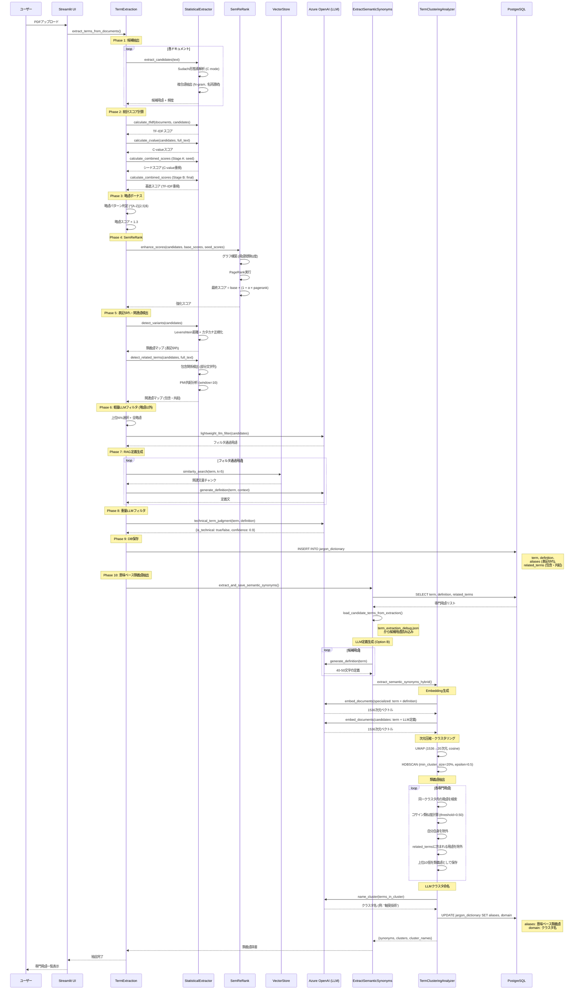

# 用語抽出フロー

## シーケンス図



## 主要フェーズ詳細

### Phase 1: 候補抽出
- **技術**: Sudachi形態素解析 (ハイブリッドアプローチ)
  - **Mode A (短単位)**: N-gram生成、品詞判定、形態素数計算
  - **Mode C (長単位)**: 自然な複合語抽出 (例: "舶用ディーゼルエンジン")
- **手法**:
  1. Mode C複合語抽出
  2. Mode A + N-gram (名詞連続パターン)
- **出力**: 候補用語 + 頻度

### Phase 2: 統計スコア計算
- **TF-IDF**: 文書全体での重要度
- **C-value**: 複合語としての専門性
- **2段階スコアリング**:
  - Stage A (seed): C-value重視 → SemReRankのシード選定用
  - Stage B (final): TF-IDF重視 → 最終スコア計算用

### Phase 3: 略語ボーナス
- **判定パターン**: `^[A-Z]{2,5}$`
- **ボーナス倍率**: 1.3倍
- **目的**: 技術文書で重要な略語を優先

### Phase 4: SemReRank
- **グラフ構築**: 用語間の意味的類似度
- **アルゴリズム**: PageRank
- **最終スコア**: `base_score × (1 + α × pagerank_score)`

### Phase 5: 表記ゆれ・関連語検出
#### 表記ゆれ (variants)
- Levenshtein距離
- カタカナ正規化
- 例: "コンピュータ" ↔ "コンピューター"

#### 関連語 (related_terms)
- **包含関係**: 部分文字列検出
  - 例: "ILIPS" ⊂ "ILIPS環境価値管理"
- **PMI共起分析**:
  - ウィンドウサイズ: 10単語
  - 閾値: PMI ≥ 2.0, 共起回数 ≥ 3

### Phase 6: 軽量LLMフィルタ
- **対象**: 略語以外の上位N%
- **目的**: 定義生成コストを削減
- **略語**: 無条件で次フェーズへ

### Phase 7: RAG定義生成
- **検索**: ベクトル類似度検索 (k=5)
- **略語対応**: クエリ拡張 (例: "ETC 略語")
- **LLM**: Azure OpenAI GPT-4
- **出力**: 専門用語の定義文

### Phase 8: 重量LLMフィルタ
- **判定**: 専門用語 vs 一般用語
- **出力**: `{is_technical: bool, confidence: float}`
- **バッチ処理**: 10件/バッチ

### Phase 9: DB保存
```sql
INSERT INTO jargon_dictionary (
  term,
  definition,
  aliases,          -- 表記ゆれ (Phase 5)
  related_terms     -- 包含・共起関係 (Phase 5)
)
```

### Phase 10: 意味ベース類義語抽出
#### Step 1: データ読み込み
- **専門用語**: DB (`term`, `definition`, `related_terms`)
- **候補用語**: `term_extraction_debug.json`

#### Step 2: LLM定義生成 (Option B)
- **対象**: 候補用語 (定義なし)
- **長さ**: 40-50文字
- **目的**: 候補用語の意味情報を充実化
- **効果**: F1スコア 83.3%, Recall 93.8%

#### Step 3: Embedding生成
- **専門用語**: `"{term}: {definition}"`
- **候補用語**: `"{term}: {LLM定義}"`
- **モデル**: text-embedding-3-small
- **次元**: 1536

#### Step 4: 次元圧縮・クラスタリング
- **UMAP**: 1536次元 → 20次元 (cosine距離)
- **HDBSCAN**:
  - `min_cluster_size`: データ数の20%
  - `cluster_selection_epsilon`: 0.5

#### Step 5: 類義語抽出
- **同一クラスタ内**で類似度計算
- **コサイン類似度**: threshold = 0.50
- **除外ルール**:
  1. 自分自身
  2. `related_terms`に含まれる用語 (包含・共起関係)
- **最大数**: 10件/用語

#### Step 6: LLMクラスタ命名
- **入力**: クラスタ内の用語リスト
- **出力**: クラスタ名 (例: "軸受技術", "環境・持続可能技術")

#### Step 7: DB更新
```sql
UPDATE jargon_dictionary SET
  aliases = [...],    -- 意味ベース類義語で上書き
  domain = '...'      -- クラスタ名
```

## データフロー

```
PDFファイル
  ↓
候補用語 (Phase 1-4)
  ↓
表記ゆれ検出 (Phase 5) → aliases (一時)
  ↓
関連語検出 (Phase 5) → related_terms
  ↓
LLMフィルタ + 定義生成 (Phase 6-8)
  ↓
DB保存 (Phase 9)
  term, definition, aliases (表記ゆれ), related_terms
  ↓
意味ベース類義語抽出 (Phase 10)
  ↓
DB更新
  aliases ← 意味ベース類義語 (上書き)
  domain ← クラスタ名
```

## 重要な注意点

### aliases フィールドの2段階更新
1. **Phase 9**: 表記ゆれ (Levenshtein距離ベース)
2. **Phase 10**: 意味ベース類義語 (HDBSCAN + LLM) で**上書き**

### related_terms vs aliases の違い
- **related_terms** (包含・共起):
  - 包含関係: "ILIPS" ⊂ "ILIPS環境価値管理"
  - PMI共起: 同じ文脈で頻繁に出現
  - **Phase 10で除外**: 類義語に含めない

- **aliases** (意味ベース類義語):
  - 同一クラスタ内の意味的に近い用語
  - コサイン類似度 ≥ 0.50
  - `related_terms`に含まれない用語のみ

### 最適化済みパラメータ
- **類似度閾値**: 0.50 (F1=83.3%, Recall=93.8%, Precision=75.0%)
- **HDBSCAN epsilon**: 0.5
- **最大類義語数**: 10件/用語

## ファイル構成

- **src/rag/term_extraction.py**: Phase 1-9のメインロジック
- **src/rag/advanced_term_extraction.py**: StatisticalExtractor実装
- **src/scripts/extract_semantic_synonyms.py**: Phase 10のエントリポイント
- **src/scripts/term_clustering_analyzer.py**: HDBSCAN + UMAP実装
- **output/term_extraction_debug.json**: 候補用語の中間ファイル
